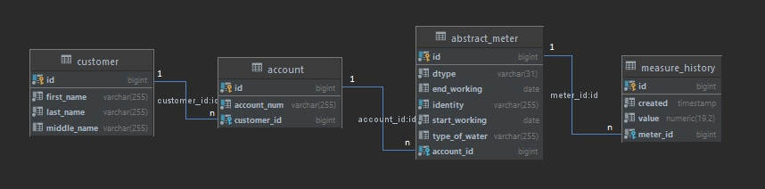

# Test task: Implementation of a REST application "Gas & Water Usage Monitoring Application"

Create an application to monitor gas, cold and hot water usage. No UI needed, only REST API. Two REST API methods should be implemented: one for submitting the current measurements for a given user, other for getting the history of previously submitted measurements for a given user. User inputs should be validated to reject incomplete or invalid data.

Technical Requirements
1.	Use Java 1.8, Spring Framework and Maven.
2.	Use other Java libraries as needed.
3.	Use HSQLDB for storing data. It is ok NOT to persist data across application launches.
4.	Try to follow all the good principles of writing high-quality and testable code. Use Swagger to describe REST. When creating a database, do not forget about indexes, etc., etc.
5.	Fill in missing requirements as you feel suitable.
6.	Include a short README file describing how the application works and how to build and run the project.
      The approximate time to complete this sample task is 6 hours. Focus on the most essential features first. It is fine to leave TODOs in places across the code, where a certain feature is missing, but you would have implemented it if you had more time.

---

##  📣 Application description

Used stack: Java 8, Maven, Spring Boot, Spring Web, Spring Data JPA (Hibernate), HSQL, Liquibase, Swagger.

Application starts at ```8080``` port.

---

The application allows you to maintain a database of customers (first name, middle name, last name).
Each customer can have several accounts (for example, one account for each customer's apartment).
The account has an unique identifier (for example, 1801345A22), and a list of meters associated with it.
There are 2 types of meters implemented in the system: a gas meter and a water meter. The water meter can be either for hot or cold water.
Each meter has parameters: identification number, date of putting into exploitation and date of removal from it.


---


## REST endpoints

> **Note:** The application contains the <a href="https://swagger.io/">Swagger</a> for REST documenting:<br>
> <a href="http://localhost:8080/v2/api-docs">localhost:8080/v2/api-docs</a><br>
> <a href="http://localhost:8080/documentation/swagger-resources">localhost:8080/documentation/swagger-resources</a><br>
> <a href="http://localhost:8080/documentation/swagger-ui/">localhost:8080/documentation/swagger-ui/</a>
>
####There are 3 endpoints:


###```GET /account/{accountNumber}```
Displays account information. Includes information about a customer, information about attached meters and characteristics of these meters.
Response example:
```
{
  "userName": "Ivan Ivanovich I.",   //Full name of the customer. Only the first letter of the last name is displayed
  "accountNumber": "1801345A22",    //Customer's account
  "meters": [                       //List of attached meters
    {
      "id": 24,                     //The unique ID of the meter. Used in submitting measurements and displaying the history of measurements
      "identity": "X000123",        //Serial number of the meter. Transmitted to the front and used to identify the meter by a customer
      "type": "WATER_HOT",          //Currently 3 types of counters are available: WATER_HOT, WATER_COLD, GAS
      "currentValue": 9.93,         //The last submitted measurement for this meter is displayed
      "startWorking": "2022-10-05", //Date of putting into exploitation
      "endWorking": null            //Date of removal from exploitation
    },
    {
      "id": 25,
      "identity": "X000100",
      "type": "WATER_HOT",
      "currentValue": null,
      "startWorking": "2021-01-01",
      "endWorking": "2022-10-04"
    },
    {
      "id": 26,
      "identity": "G000200",
      "type": "GAS",
      "currentValue": null,
      "startWorking": "2022-09-01",
      "endWorking": null
    }
  ]
}
```

###```GET /meter/{meterId}/history```
Отображает список показаний по конкретному счётчику. <b>meterId</b> = <b>id</b> счётчика из запроса ```GET /account/{accountNumber}```.
Пример ответа:
```
[                                           //Список переданных показаний по счётчику. Наиболее свежие показания ввержу списка
  {
    "created": "2022-10-05T15:43:38.123",   //Дата передачи показания
    "value": 9.93                           //Значение
  },
  {
    "created": "2022-10-05T15:43:38.121",
    "value": 1.15
  }
]
```

###```POST http://localhost:8080/meter/{meterId}/history``` 
Передача показаний по конкретному счётчику. <b>meterId</b> = <b>id</b> счётчика из запроса ```GET /account/{accountNumber}```.
Пример тела запроса:

```{"value": 100.56}```

Значение value должно быть числом (разделитель - точка). Value не может быть меньше предыдущего отправленного показания


## Структура БД




## Что ещё стоит реализовать:

* сделать логику работы счётчика по циклу, в соответствии с максимальным значением на циферблате
* сделать защиту от сабмита показаний на чужой счётчик
* добавить контроллеры для управления пользователями/счетами/счётчиками/показаниями
* сделать логику, которая позволяет отменить ошибочно переданное значение. Сейчас, например, если пользователь передаст заведомо большее значение, то он уже не сможет его отменить

---


* Konstantin Zubrilin | [HH.ru](https://khabarovsk.hh.ru/resume/435d1f0fff09745a940039ed1f58434b424b39) |  456kot@mail.ru
